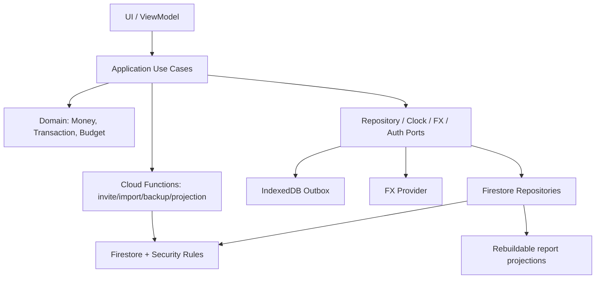

# MyExpenseApp 架构演进方案

> 目标是优先修好女朋友实际使用的 VND 私人账本，而不是建设通用财务平台。项目所有者的第二账号和 CNY 切换服务于查看/维护。账号、登录规则和数据已在 Firebase；任何线上 Rules 修改或迁移仍需单独授权。

> T019 决策更新：项目所有者已选择 ADR-003 的方案 A。当前路线稳定现有 legacy 年度矩阵；T011/T012 Account/Transaction 模型不进入交付主线，不得默认迁移、接入 UI、扩展 Firestore schema 或写生产数据。
>
> **⚠ UXS 阶段范围（ADR-004）：** 本架构文档包含部分面向通用 Account/Transaction 模型的远期设计，这些内容属于被 ADR-003 拒绝或延期至新 ADR 的范围。当前施工以 `UI_SAVINGS_REDESIGN_PLAN.md`、`TASK_PLAN.md`、ADR-003 和 ADR-004 为唯一依据。以下标注为 **Superseded** 的章节仅作为历史参考保留。

## 1. 当前架构问题

### 1.1 边界问题

- `main.js` 集中处理入口、交互、币种转换、年份、导入导出和活动会话，属于 God Module。
- `state` 是所有模块可写的全局对象，领域逻辑与 DOM 状态没有隔离。
- `render.js` 同时包含渲染、streak 计算、localStorage、保存与烟花动画。
- `budget.js` 同时执行全年聚合、预算、资产对账、DOM 更新和图表触发。
- 业务对象用 DOM ID 和字符串 key 表达，界面结构成为数据库 schema。

### 1.2 数据问题

- 年度单文档是聚合快照，不是交易事实源。
- 固定路径符合单账本设计，但仓库无法独立证明线上 Rules 只授权两个既有 UID。
- 金额是浮点 Number/公式字符串，没有币种精度与汇率快照。
- 没有 schemaVersion、createdAt、updatedAt、createdBy、version、deletedAt。
- 没有迁移、审计、备份、冲突和幂等模型。

### 1.3 运行问题

- 客户端直写与快照整体覆盖，保存超时语义错误。
- 每次输入全量重算全年数据并更新图表。
- PWA 只缓存静态资源，没有可靠业务 outbox。
- 主 JS 打包 737.33 kB；图表和烟花首屏加载。
- 无自动化测试、CI、错误遥测和发布回滚证明。

## 2. 目标架构

### 2.1 架构选择

采用 **Firebase 上的模块化单体前端 + 受控 Serverless 能力**，不立即建设传统常驻后端。

> **当前实施范围：** UXS 阶段以 legacy `entries` 矩阵为事实源，不引入独立 Account/Transaction 领域模型。以下第 2.1 节中关于 Account/Transaction 领域的描述属于远期目标，当前不实施。

- 客户端：保留 Vite，逐步迁移为 TypeScript；先不强制引入大型 UI 框架，避免在数据迁移期同时重写全部页面。
- 领域层：纯 TypeScript，定义 Money、Transaction、Account、Budget 等，不依赖 DOM/Firebase；不建立 Household/Membership/角色模型。
- 应用层：用例/命令处理器，统一验证、权限前置、幂等、同步状态。
- 基础设施层：Firestore repositories、Auth adapter、IndexedDB outbox、FX provider、telemetry。
- UI 层：页面组件/DOM view 只消费 ViewModel，不直接写 Firestore。
- 受信服务端：仅在确有需要时用 Firebase Callable/HTTP Functions 承载批量导入、备份恢复、聚合维护和未来 AI 代理；不建设邀请或成员管理服务。
- 数据授权：Firestore Security Rules 是强制边界，客户端校验只用于体验。

### 2.2 目标关系



依赖规则：`ui → application → domain`；`infrastructure → application/domain ports`。Domain 不得 import Firebase、DOM、Chart.js 或 localStorage。

## 3. 模块重新划分

> **⛔ SUPERSEDED per ADR-003/ADR-004。** 本节描述的完整模块目录（含 transactions/、accounts/）属于被拒绝的迁移方案。UXS 阶段不建立独立 transaction/account 应用层或 repository。目录结构作为历史参考保留。

建议目标目录：

```text
src/
├─ domain/
│  ├─ money.ts
│  ├─ transaction.ts
│  ├─ account.ts
│  ├─ budget.ts
│  └─ errors.ts
├─ application/
│  ├─ transactions/create-transaction.ts
│  ├─ transactions/update-transaction.ts
│  ├─ accounts/manage-account.ts
│  ├─ budgets/save-budget.ts
│  ├─ reports/build-summary.ts
│  └─ sync/sync-outbox.ts
├─ infrastructure/
│  ├─ firebase/auth-adapter.ts
│  ├─ firebase/ledger-repository.ts
│  ├─ firebase/transaction-repository.ts
│  ├─ storage/indexeddb-outbox.ts
│  ├─ fx/fx-provider.ts
│  └─ telemetry/reporter.ts
├─ ui/
│  ├─ auth/
│  ├─ onboarding/
│  ├─ transactions/
│  ├─ accounts/
│  ├─ budgets/
│  ├─ reports/
│  └─ shared/
└─ legacy/                     # 迁移期旧矩阵适配，迁移结束删除
functions/src/
├─ imports/
├─ backups/
└─ projections/
tests/
├─ unit/
├─ integration/
├─ rules/
└─ e2e/
```

### 模块职责

- Identity：认证状态；应用只接受两个既有账号，最终授权由 Firestore Rules 强制执行。
- Shared Ledger Boundary：唯一逻辑账本、女朋友主记账、项目所有者查看/维护；权限以线上 Rules 为准，不暴露建账本、邀请、角色或成员管理。
- Ledger Settings：名称、固定 VND、`Asia/Ho_Chi_Minh` 时区、功能开关。
- Accounts：账户元数据与期初余额。
- Transactions：收入、支出、转账、软删除、版本与审计。
- Categories/Tags：账本内字典，不直接嵌入交易显示文案。
- Budgets：月度总额/分类限额与阈值。
- Reports：从交易事实生成可下钻的只读聚合。
- Reconciliation：账户截止日的系统余额与实际余额。
- Sync：本地命令 outbox、确认、冲突、重试。
- Import/Export：版本化交换与恢复，不与页面控制器混合。

## 4. 数据库优化方案

### 4.1 建议 Firestore 模型

> **⛔ SUPERSEDED per ADR-003/ADR-004。** 以下 Firestore 模型（accounts/、transactions/、categories/、reconciliations/ 等集合）属于被拒绝的迁移方案。当前事实源为 legacy `shared_ledger_<year>` 文档。仅保留为未来参考。

```text
artifacts/{projectId}/private/data/sharedLedger/config
  baseCurrency, timezone, schemaVersion, createdAt, updatedAt

artifacts/{projectId}/private/data/sharedLedger/accounts/{accountId}
  name, type, openingBalanceVnd, openingDate,
  archivedAt, version, createdAt, updatedAt

artifacts/{projectId}/private/data/sharedLedger/categories/{categoryId}
  kind, name, icon, color, sortOrder, archivedAt

artifacts/{projectId}/private/data/sharedLedger/transactions/{transactionId}
  kind, accountId, amountVnd,
  occurredAt, localDate, categoryId, tagIds, note,
  createdBy, updatedBy, createdAt, updatedAt,
  version, deletedAt, idempotencyKey

artifacts/{projectId}/private/data/sharedLedger/budgets/{yyyy_mm}
  totalLimitMinor, categoryLimits, thresholds, version, updatedBy

artifacts/{projectId}/private/data/sharedLedger/reconciliations/{id}
  accountId, statementAt, systemBalanceMinor,
  actualBalanceMinor, differenceMinor, status

artifacts/{projectId}/private/data/sharedLedger/auditEvents/{eventId}
  entityType, entityId, action, actorUid, occurredAt,
  beforeHash, afterHash, operationId

artifacts/{projectId}/private/data/sharedLedger/reportProjections/{periodKey}
  rebuildable aggregates, sourceWatermark, schemaVersion
```

上述仅保留为被拒绝迁移方案的历史草案和未来参考。ADR-003 选择继续稳定现有 legacy 年度矩阵；现有 `shared_ledger_<year>` 继续作为事实源，不因 T011/T012 存在而默认迁移。

### 4.2 金额与汇率

- 当前事实金额固定为 VND 整数；预算、余额、entries 和报表都以 VND 为准。
- CNY 是 ViewModel 的辅助显示，可按当前汇率重算，不持久化为交易事实。
- 展示切换不得写入 raw state、pendingUpdates 或 Firestore。
- T011/T012 中的多币字段属于冻结探索；ADR-003 已决定不继续迁移。若未来重新考虑，必须先新建 owner-approved ADR，并删除非 VND 事实字段。

### 4.3 索引与查询

> **当前实施：** UXS 阶段不建立 transactions 集合，不创建对应索引。以下索引仅适用于未来迁移场景。

首批复合索引按实际页面建立：

- shared-ledger transactions：`deletedAt + occurredAt desc`；
- `accountId + deletedAt + occurredAt desc`；
- `categoryId + deletedAt + occurredAt desc`；
- `createdBy + deletedAt + occurredAt desc`。

标签数组查询与多筛选组合可能导致索引爆炸；V1 先限制同时使用的高选择性过滤器，并用查询规划/遥测决定是否引入搜索服务。列表必须 cursor 分页，禁止 offset。

### 4.4 聚合策略

- MVP 数据量小：按月查询交易，在客户端纯函数聚合，结果必须可下钻。
- 数据量增加后：Cloud Function 维护月度 projection；每个 projection 带 source watermark，可离线重建并与逐笔求和校验。
- 不把 projection 当事实源；投影错误不允许修改原交易。

### 4.5 迁移策略

> **⛔ SUPERSEDED per ADR-003/ADR-004。** 本节描述的从 legacy 矩阵到新交易模型的迁移策略已被 ADR-003 拒绝。当前不移入独立 Transaction 模型，不执行迁移。

1. 冻结并备份每个 `shared_ledger_<year>` 原文档，记录哈希与大小。
2. 实现 legacy parser，把 `<month>_<day>_<category>` 公式解析成迁移交易。由于旧数据把多笔金额合在公式中且只有整日备注，无法可靠恢复每笔真实交易；迁移规则必须向用户展示。
3. 建议把表达式每一项拆为同日同分类的独立迁移交易；备注默认挂到当日迁移批次或按产品确认分配。
4. 双读阶段：旧汇总和新交易逐月比较收入、支出和分类合计，差异必须为 0 minor unit。
5. 灰度切新写；旧数据只读；保留回滚开关。
6. 稳定期后移除 legacy writer，再在明确保留期后归档旧文档。

## 5. 接口设计规范

即使使用 Firestore SDK，也必须通过 application/repository 接口，UI 不直接拼路径。

### 5.1 命令信封

```json
{
  "operationId": "uuid",
  "ledgerId": "shared",
  "actorUid": "derived-on-server-not-trusted-from-client",
  "expectedVersion": 3,
  "payload": {}
}
```

- `operationId` 保证重试幂等；服务端身份从 token 获取，不信任 payload。
- 更新/删除带 `expectedVersion`；冲突返回 `CONFLICT` 和当前版本。
- 错误统一为 `{code, messageKey, retryable, fieldErrors, correlationId}`。
- 时间输入 ISO 8601 带 offset，内部转 UTC；报表范围以账本时区解释。
- 列表返回 `{items, nextCursor, hasMore, snapshotAt}`。

### 5.2 错误码

至少定义：`UNAUTHENTICATED`、`EMAIL_UNVERIFIED`、`FORBIDDEN`、`NOT_FOUND`、`VALIDATION_FAILED`、`CONFLICT`、`DUPLICATE_OPERATION`、`RATE_UNAVAILABLE`、`QUOTA_EXCEEDED`、`OFFLINE_QUEUED`、`INTERNAL`。

UI 只展示稳定本地化文案；原始第三方错误进入脱敏日志。

### 5.3 安全规范

- Rules 默认 deny；每种资源显式校验当前 UID 属于固定双人授权集合、字段类型、不可变字段和大小。
- 受信 Function 再次鉴权，不因客户端已验证而跳过。
- 禁止用户内容进入 `innerHTML`；必须用 text/value 或经过审计的 sanitizer。
- 配置中的 Firebase web apiKey 是公开客户端标识，不当作秘密；真正秘密只放服务端 secret manager，并限制 API key 的 API/来源。
- CSP 至少限制 `default-src/script-src/connect-src/img-src/style-src/font-src`；实际域名按 Firebase 与汇率供应商清单确定。
- 日志不含 token、密码、完整邮箱、备注或金额明细。

## 6. 代码规范

### 6.1 类型与边界

- 新领域/应用代码使用 TypeScript strict；禁止 `any` 绕过边界。
- 持久数据必须经 runtime schema 校验（建议 Zod 或等价方案）。
- DOM、Firestore、localStorage、fetch 只能出现在 adapter/UI 层。
- `Date.now()`、随机 ID、汇率、网络均通过可注入 port，保证测试确定性。

### 6.2 金额规范

- 禁止用浮点数持久化或聚合金额。
- 禁止以公式字符串保存交易事实。
- 每个舍入点必须命名并测试；禁止隐式 `Math.round` 分散在 UI。
- 格式化只在展示层发生。

### 6.3 变更规范

- 一次提交一个任务；先写失败测试，再实现，再跑完整相关测试。
- 数据 schema 变更必须同时提交 migration、Rules、索引和回滚说明。
- 不允许用“构建成功”替代业务测试/Rules 测试。
- 重要决策写 ADR：数据模型、金额模型、同步策略、迁移拆分规则。
- PR 必须说明数据兼容、权限影响、性能影响和验证证据。

### 6.4 测试金字塔

- 单元：Money、日期、交易规则、预算、聚合、CSV/schema。
- 集成：repository + Firestore Emulator、outbox、migration。
- Rules：授权账号 A/B 与匿名/第三 UID × 每个资源 × 读写动作。
- E2E：两个既有账号登录/记账/离线恢复/导入导出/跨日，另测第三 UID 拒绝。
- 迁移验证：旧月汇总与新逐笔汇总逐字段相等。

## 7. 可观测性与发布

- 记录匿名化的 error code、operationId、模块、版本、耗时、在线状态；不记录财务内容。
- 关键指标：确认写入延迟、outbox 深度、失败率、冲突率、Rules 拒绝率、projection 漂移、导入拒绝行数。
- CI 门禁：格式/类型/单元/集成/Rules/E2E smoke/build/依赖审计/包体预算。
- 环境分 dev/staging/prod Firebase project；生产数据不得用于开发测试。
- 发布采用 feature flag 和小比例账本灰度；迁移前后自动校验；保留一键只读回退。

## 8. 演进阶段

### Phase 0：止血与证据基线

修复 XSS、同步伪成功、CSV/导入安全；加入测试、Rules 入库和 CI；不改变数据模型。

### Phase 1：先修现有产品主链路

从现有年度 `entries` 派生连续天数，统一直接录入/快速录入/云端快照刷新，修复 7/30 天奖励；验证 VND 保存与 CNY 仅展示；核对线上 Firebase Rules。T011/T012 新模型保持未接线状态。

### Phase 2：T019 已决定不迁移新模型

ADR-003 已选择稳定 legacy 年度矩阵。独立 Account/Transaction 不再是默认后续路线；T011/T012 保持未接线，并应在后续单独 cleanup 任务中删除或隔离。只有新的项目所有者批准 ADR 才能重新评估备份、dry-run、双读校验和 UI 切换。

### Phase 3：可靠离线与恢复

按实际需要加入备份恢复、IndexedDB outbox、冲突处理和月度对账；不建设成员协同平台。

### Phase 4：智能能力

在权限、事实数据、遥测和用户授权成熟后再建设 OCR/AI；通过服务端代理，建议不自动落账。

## 9. 架构验收门槛

- 两个既有账号可以通过客户端读写同一本账，匿名或第三 UID 无法通过直接 SDK 访问。
- 两台设备同时创建交易不会丢失任一笔。
- 任意报表总额可逐笔重算，差异恒为 0 minor unit。
- 断网创建后重启应用，操作仍在 outbox；联网后只落一次。
- 旧账迁移每月收入、支出、分类合计与旧系统一致。
- 恶意备注、分类、导入文件和 CSV 内容均不能执行脚本/公式。
- 所有上述结论由自动化测试和新鲜运行输出证明。
