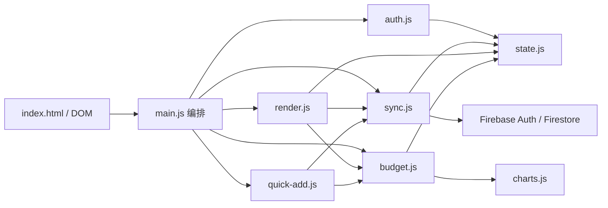
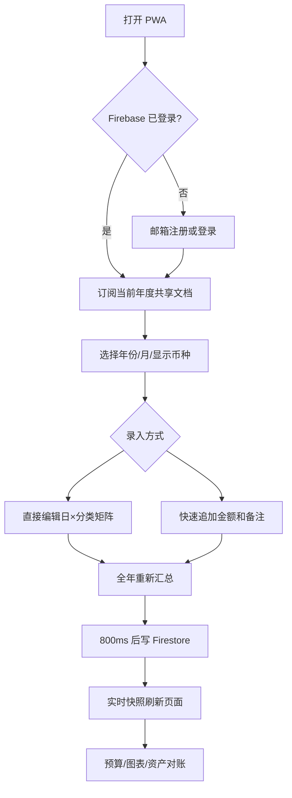

# MyExpenseApp 项目接管分析

> 审计日期：2026-07-17  
> 审计范围：仓库内全部 28 个非构建源文件；重点逐行阅读 `index.html`、`src/js/*.js`、PWA 配置、依赖与构建配置。  
> 约束：本报告只描述仓库代码能够证明的事实。Firestore Security Rules、Firebase 控制台配置、线上部署平台、生产数据规模和真实用户行为不在仓库中，均标为“无法确认”。

## 1. 执行摘要

MyExpenseApp 2.0 是一个由项目所有者与女朋友共同使用的私人单页 PWA。它使用 Vite 构建、原生 JavaScript ES Modules 组织前端，以 Firebase Authentication 完成两个既有账号的邮箱密码登录，以 Firestore 的单个“年度共享账本文档”保存双方共同编辑的数据。

当前实现更准确的领域定义是：**年度共享收支矩阵**，而不是标准的“交易流水账”。每一天、每一支出分类只有一个聚合单元格；同日同分类的多次录入被拼成算术表达式。账户只体现为年初/年末四类余额快照，没有交易账户、转账、标签、账本成员、角色或审计日志。

项目优点是代码量小、上手成本低、交互闭环完整，已经具备登录、快速记账、实时同步、预算、统计图表、双币展示、CSV 导出、JSON 导入、PWA 和连续记账激励。主要生产化障碍不是页面样式，而是数据模型、并发同步、数据隔离、安全渲染、金额精度和自动化测试。

## 2. 项目结构

```text
MyExpenseApp/
├─ index.html                 # 单页 UI 骨架、登录层、PWA 注册
├─ package.json               # Vite/Tailwind/Chart.js/Firebase
├─ vite.config.js             # 开发与静态构建
├─ src/
│  ├─ css/app.css             # 全部页面样式
│  └─ js/
│     ├─ main.js              # 入口、全局事件、页面编排、导入导出
│     ├─ state.js             # 内存状态与 pending 更新队列
│     ├─ firebase.js          # Firebase 客户端初始化
│     ├─ auth.js              # 邮箱密码鉴权、20 分钟前端会话计时
│     ├─ sync.js              # Firestore 监听、延迟保存、JSON 导入
│     ├─ render.js            # 月表格、连续记账、DOM 渲染
│     ├─ budget.js            # 汇总、预算、资产对账
│     ├─ charts.js            # Chart.js 年/月分类图
│     ├─ quick-add.js         # 快速追加收支
│     ├─ utils.js             # 公式解析、金额格式化、localStorage
│     ├─ config.js            # 固定分类、默认汇率、默认预算
│     ├─ icons.js             # SVG 图标
│     └─ fireworks.js         # 激励动画
├─ public/
│  ├─ sw.js                   # 网络优先的静态资源 Service Worker
│  └─ manifest.json           # PWA 清单
└─ dist/                      # 构建产物（被 .gitignore 忽略）
```

仓库中没有 `README`、`AGENTS.md`、测试目录、CI 配置、Firebase Rules、Firestore indexes、Firebase Hosting 配置、环境变量样例或部署脚本。

## 3. 技术栈与运行形态

| 层次 | 实际技术 | 代码证据 | 结论 |
|---|---|---|---|
| 前端 | 原生 JavaScript ES Modules + HTML | `index.html:11`、`src/js/main.js` | 无 React/Vue 等组件框架，DOM 由字符串和事件代理驱动 |
| 样式 | Tailwind CSS 3 + 自定义 CSS | `package.json`、`src/css/app.css` | 构建期生成 CSS |
| 图表 | Chart.js 4 | `src/js/charts.js:1` | 两个横向分类柱状图 |
| 构建 | Vite 6 | `vite.config.js` | `npm run dev/build/preview`，构建结果为静态站点 |
| 鉴权 | Firebase Authentication | `src/js/auth.js:4-9` | 仅邮箱/密码注册、登录、退出 |
| 数据库 | Cloud Firestore | `src/js/firebase.js`、`src/js/sync.js` | 客户端直连，没有自建后端 API |
| 缓存 | Service Worker Cache、localStorage、Firebase SDK 内存行为 | `public/sw.js`、`utils.js` | 没有业务缓存层；未显式启用 Firestore 持久离线缓存 |
| 消息队列 | 无 | 全仓库 | 实时更新由 Firestore `onSnapshot` 提供 |
| 部署 | 静态构建可部署 | `vite.config.js` | 具体线上平台与发布流程无法从仓库确认 |
| 第三方服务 | Firebase、汇率 CDN API、Google Fonts | `firebase.js`、`auth.js:71`、`index.html:8-10` | 汇率源无超时与结果时间戳展示 |
| AI | 无 | 全仓库无 AI SDK/API/提示词 | 当前不存在 AI 能力 |

验证结果：`npm run build` 成功，Vite 转换 36 个模块；主 JS 产物约 737.33 kB（gzip 204.26 kB），出现超过 500 kB 的分包警告。使用官方 npm registry 执行生产依赖审计，结果为 0 个已知漏洞。该结果只覆盖 npm 已知依赖漏洞，不代表应用安全无问题。

## 4. 当前架构

### 4.1 模块依赖



`main.js` 既是启动器，也是 UI 控制器、输入转换器、年份/币种状态机和导出服务。`render.js` 同时负责表格渲染、打卡领域逻辑和动画；`budget.js` 同时负责聚合计算、预算 UI、年度资产对账和图表触发。模块已有文件级拆分，但业务边界仍互相穿透，多个模块直接读写全局可变 `state` 和 DOM。

### 4.2 数据流

登录读取链路：

1. `initAuth()` 监听 Firebase 用户状态。
2. 登录后 `setupRealtimeListener()` 订阅 `shared_ledger_<year>`。
3. 快照整体写入 `state.appState.balances/entries/settings`。
4. `softUpdateDOM()` 把内存状态写回当前页面，再执行全年聚合和图表更新。

编辑保存链路：

1. 表格/余额输入由 `document.body` 的 `input` 事件统一捕获。
2. CNY 输入按当前汇率换算为 VND 字符串；VND 输入原样保存。
3. 同时修改 `appState` 与 `pendingUpdates`。
4. `triggerCloudSave()` 以 800 ms 防抖，复制并清空 pending 后调用 `setDoc(..., {merge:true})`。
5. Firestore 快照再次覆盖本地 `appState` 并刷新 DOM。

快速记账链路：

1. 用户选择当前页面的月份、日和固定分类。
2. 新金额被追加为 `=<旧表达式>+<新金额>`。
3. 备注以逗号拼接到该日唯一备注字段。
4. 重新计算全年数据，触发保存，并按“操作发生的今天”更新连续记账。

### 4.3 核心业务链路

- 注册/登录：任何通过 Firebase 邮箱密码注册成功的用户都会进入同一客户端数据路径；是否能读取数据最终取决于仓库外的 Firestore Rules。
- 记支出：年 → 月 → 日 → 固定分类单元格，允许直接录入公式或快速追加金额。
- 记收入：每个自然日只有一个“当日总收入”聚合字段。
- 汇总：每次输入后遍历全年 12 个月、每天和 10 个分类，重算月/年分类合计。
- 预算：每年文档内保存月预算，缺失时退回年度通用预算，再退回浏览器 localStorage 和默认值。
- 对账：年初四类余额 + 年度收入 - 年度支出 = 理论年末资产，与手工年末四类余额比较。
- 协同：多个已获授权的客户端监听同一年度文档，采用字段级最终写入，没有冲突检测或操作日志。

## 5. 当前领域模型

### 5.1 代码中实际存在的模型

```text
FirebaseUser
  uid, email, ...              # Firebase SDK 对象，业务数据未引用 uid

AnnualSharedLedger
  documentId = shared_ledger_<year>
  balances: Map<fixedBalanceKey, FormulaOrNumberString>
  entries: Map<month_day_field, FormulaOrTextString>
  settings:
    monthlyBudget
    budget_<month>
    expense_streak
    expense_last_date
```

固定余额键：`bal-bank`、`bal-alipay`、`bal-wechat`、`bal-other` 及对应 `end-bal-*`。  
支出键：`<month>_<day>_<categoryId>`；收入键：`<month>_<day>_income`；备注键：`<month>_<day>_remark`。  
固定支出分类：餐饮、购物、房租、交通、通信、水电燃气、娱乐、健康、人情社交、其他。

### 5.2 用户要求的标准模型与当前覆盖差距

| 领域对象 | 当前状态 | 关键差距 |
|---|---|---|
| 用户 | 两个既有 Firebase 用户共同使用 | uid 不进入账本路径；账号和线上授权规则由项目所有者在 Firebase 中维护 |
| 共享账本 | 唯一逻辑账本，按年度保存共享文档 | 双人同权是产品边界；不需要 Household、多租户、邀请或角色模型 |
| 账户/钱包 | 四类年初/年末余额字段 | 无独立账户 ID、币种、期初余额、实时余额、归档 |
| 交易记录 | 不存在独立交易 | 同日同类合并成公式；无 ID、创建人、账户、时间、版本、附件 |
| 分类 | 代码内固定数组 | 不可自定义、无收入分类、无层级/归档 |
| 标签 | 不存在 | 无多维检索与分析 |
| 预算 | 月度总预算 | 无分类预算、周期、结转、阈值通知 |
| 统计分析 | 年/月分类汇总、资产对账 | 无趋势、同比环比、现金流、账户维度、可追溯明细 |
| 报表 | 页面图表与 CSV | CSV 不是规范数据交换格式；无报表快照/模板 |
| AI | 不存在 | 没有模型接入、数据脱敏、授权或 AI 场景 |

## 6. 用户操作流程现状



“邀请”按钮当前只是复制应用 URL。由于产品固定由两个既有账号使用，它不承担授权职责，后续应改为普通“分享应用链接”或移除，不能被解释为成员邀请系统。

## 7. 架构与质量结论

### 7.1 可保留的资产

- 页面与功能反馈完整，单文件域虽粗但已经按 auth/sync/render/budget/chart 分层。
- 所有持久金额统一折算为 VND 的方向清晰，年/月/日键也易理解。
- 实时监听、PWA、响应式页面和资产对账形成了可用的家庭工具原型。
- `safeEval` 至少对白名单字符、长度、非有限数做了约束，优于直接执行任意输入。

### 7.2 阻碍生产化的核心问题

1. 授权事实不在仓库：业务数据故意由两个账号共享，但无法仅从代码核对线上 Rules 是否严格拒绝第三个 UID。
2. 账务模型不可追溯：只有聚合单元格，没有不可变交易流水。
3. 同步语义不可靠：超时也显示“已同步”，无冲突版本与可靠重试。
4. 金额模型使用 JavaScript 浮点数与字符串公式，无法提供严格财务精度。
5. 渲染和导入边界未做安全编码，可形成持久化 DOM XSS。
6. 单年度单文档无法长期承载交易、标签和审计记录，并受 Firestore 1 MiB 文档限制。
7. 没有测试、规则、CI、迁移和可观测性，无法建立发布信心。

## 8. 明确信息缺口

- 仓库内 Rules 是后续加入的候选测试基线，不等同于 Firebase 线上现行 Rules；未导出前无法核对第三 UID 拒绝和写入字段限制。
- Firebase Auth 账号与登录规则已由项目所有者配置，但控制台配置不在仓库，无法从代码确认邮箱验证、密码策略、App Check、授权域名和滥用防护细节。
- 无线上 URL/托管配置：无法确认 CSP、HSTS、缓存头、回滚和发布流程。
- 无生产数据与遥测：无法量化文档大小、写频率、并发冲突、错误率和用户规模。
- 产品范围已确认：仅项目所有者与女朋友两个既有账号共享唯一账本，不支持其他家庭或公开成员管理。
- 无备份/恢复配置：只能确认客户端有覆盖式 JSON 导入和 CSV 导出。

这些缺口必须在进入生产化施工前由项目所有者补齐或通过 Firebase 控制台导出验证。
