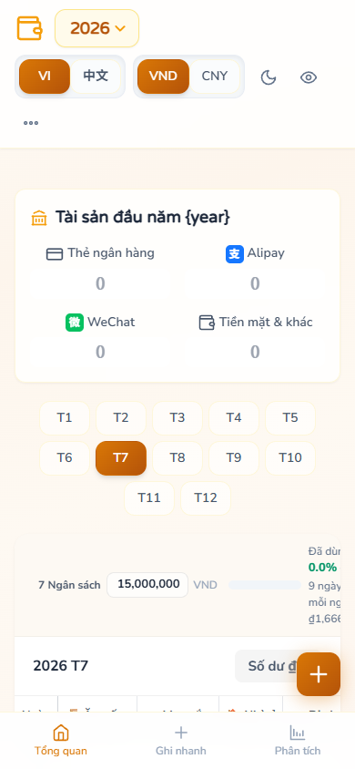
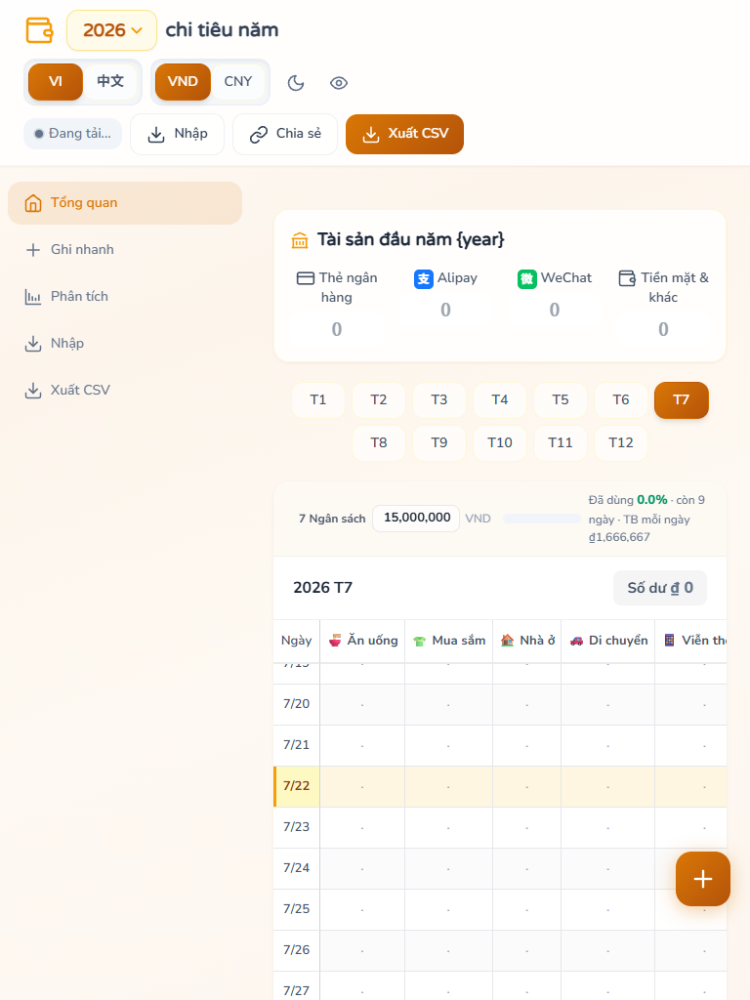
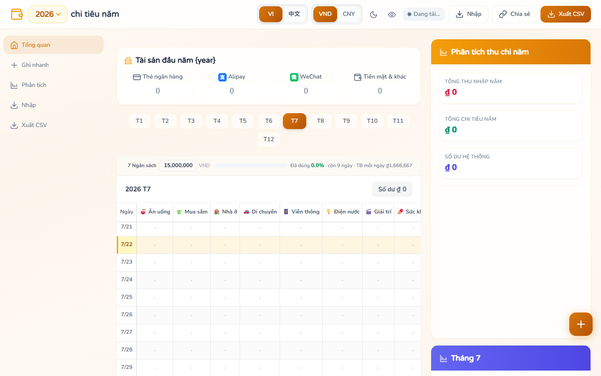
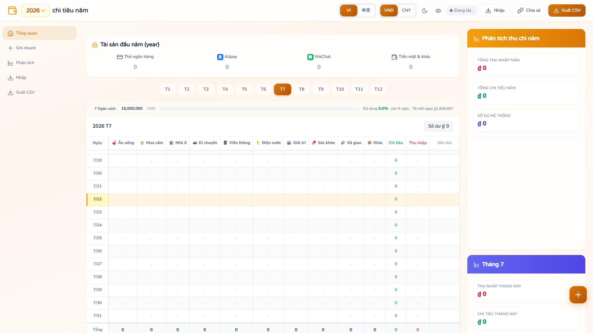

# UXS-003 Screenshot Verification

| Viewport | Overflow | Sidebar Visible | Bottom Nav Visible |
|---|---|---|---|
| 360px | ✅ No overflow | ❌ | ✅ |
| 390px | ✅ No overflow | ❌ | ✅ |
| 430px | ✅ No overflow | ❌ | ✅ |
| 768px | ✅ No overflow | ✅ | ❌ |
| 1440px | ✅ No overflow | ✅ | ❌ |
| 1920px | ✅ No overflow | ✅ | ❌ |

## Screenshots
- 
- 
- 
- 
- 
- 

## Notes
- Captured with Puppeteer.
- Breakpoint: bottom nav visible <768px, sidebar visible >=768px.
- No horizontal overflow at any viewport.
